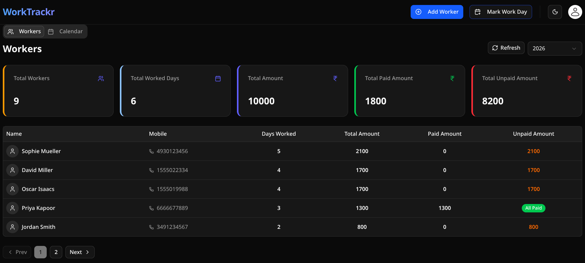
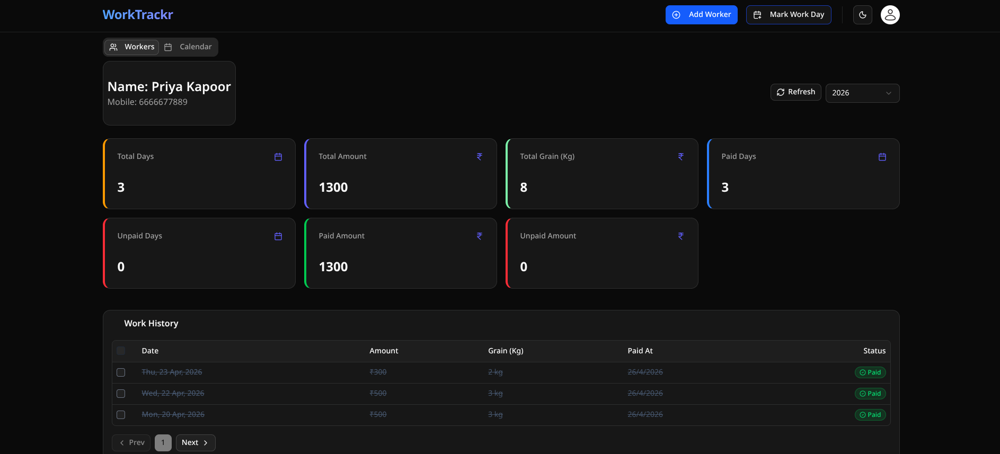
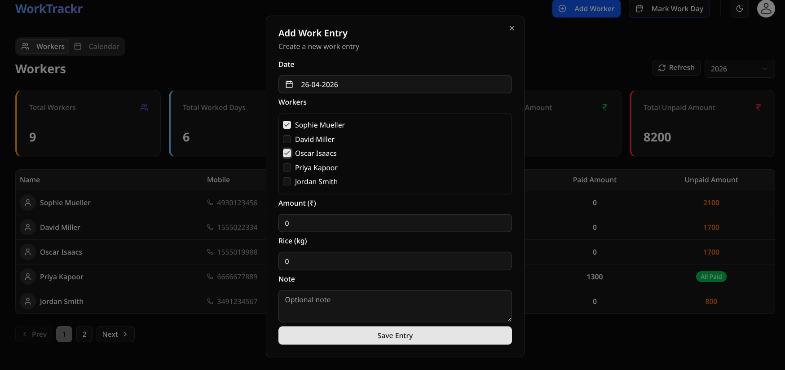

# Work Trackr

A workforce tracking and payment management system designed to replace manual attendance registers and simplify worker-based financial tracking.

🔗 **Live Demo:** https://demo-work-trackr.netlify.app

---

## 🚀 Overview

Work Trackr is built around a real-world use case where daily worker attendance and payments are traditionally managed manually.

This application digitizes the workflow by providing:

- Structured worker management
- Daily work entry tracking
- Payment status management
- Real-time summaries and analytics

The focus is on **business logic, data integrity, and maintainable architecture**, not just UI.

---

## ✨ Key Features

- 👤 Worker management (add, update, track)
- 📅 Bulk work entry creation for multiple workers per day
- 💰 Payment tracking with paid/unpaid status and timestamps
- 📊 Dashboard summaries (total days, total amount, unpaid balance)
- 📄 Worker-level analytics with paginated entries
- 🧾 Audit logging for critical actions (create, update, payment)

---

## 🏗 Architecture

### Frontend
- Next.js (App Router)
- Server Components for data fetching
- Shadcn UI for consistent design system
- Responsive dashboard (table + mobile card views)

### Backend
- REST APIs using Next.js Route Handlers
- Zod for schema validation
- Service layer for business logic separation
- Prisma ORM for database interaction

---

## 🧠 Core Engineering Concepts

- Separation of concerns (API → Service → DB)
- Server-side data fetching with query-based filtering
- Bulk operations with transactional consistency
- Audit logging system with old/new state tracking
- Pagination and URL-driven state management
---

## 🗄 Database Design

Relational schema designed for clarity and scalability:

- **Worker**
- **WorkEntry**
- **AuditLog**

Key considerations:
- One-to-many relationship (Worker → WorkEntries)
- Payment tracking per entry
- Indexed queries for date and worker-based filtering

---

## 🛠 Tech Stack

- Next.js (App Router)
- TypeScript
- Node.js
- Prisma ORM
- PostgreSQL (Neon)
- Zod
- Tailwind CSS + Shadcn UI
- Vercel (Deployment)

---

## 📸 Screenshots

### Dashboard


### Worker Details


### Work Entry Form


---

## 📁 Project Structure (Simplified)

```
src/
  app/
  components/
  services/
  lib/
  utils/
  hooks/
```

---

## 📌 Purpose

This project was built to:

- Apply real-world data modeling concepts
- Design business-focused backend systems
- Practice clean architecture in a full-stack application
- Move beyond simple CRUD into meaningful domain logic

---

## 🧑‍💻 Author

Built as a personal full-stack engineering project focused on solving practical workflow problems with clean and maintainable code.
